<div align="center">
  
  
  **Next-Generation Edge Routing, WAF, and Global Threat Mitigation Network**

  <p align="center">
    <a href="https://github.com/essex580/shielddos/blob/master/LICENSE"></a>
    
    
    
    
    
  </p>

  <p align="center">
    <i>Protect your infrastructure. Cache your static assets. Drop malicious traffic at the Edge. Observe the battlefield in 3D.</i>
  </p>
</div>

---

## ⚡ Overview

**ShieldDOS** has evolved from a simple reverse proxy into a full-fledged, highly-scalable **Edge Delivery Network**. Operating autonomously at OSI Layer 7, it sits between the chaotic public internet and your private backend infrastructure.

By terminating SSL, executing highly complex Artificial Intelligence heuristics, verifying Cloudflare Turnstile cryptographic clearances, and balancing loads geographically across distributed origins, ShieldDOS guarantees maximum uptime, pristine origin server logs, and total threat elimination.

---

## 🏗️ System Architecture

ShieldDOS utilizes a multi-layered defense-in-depth architecture to sanitize and route traffic. 

```mermaid
graph TD
    User([🌐 Global Visitor]) -->|HTTPS Request| ShieldProxy{ShieldDOS Edge Proxy}
    
    subgraph Layer 0: Network Protection
        ShieldProxy -->|Check| RedisMesh[(Redis Global Mesh)]
        RedisMesh -- "Banned?" --> Drop([❌ Drop Connection])
    end

    subgraph Layer 7: Application Defense
        ShieldProxy -->|Heuristic Engine| WAF[🛡️ AI Anomaly WAF]
        WAF -- "High Entropy" --> AttackLog([📝 Log Attack & Block])
        WAF --> Challenge[🔐 Turnstile Captcha]
        Challenge -- "Failed" --> JSBlock([🛑 Interstitial Block])
    end

    subgraph CDN & Caching
        Challenge -->|Verified Clearance| Cache[⚡ Edge Redis Cache]
        Cache -- "Cache Hit" --> ReturnCache([Return Static Asset])
    end

    subgraph Geo-Routing & Fallback
        Cache -- "Cache Miss" --> Router[🌍 Geo-Router]
        Router -->|EU Region| DE_Origin[🇩🇪 EU Origin Server]
        Router -->|US Region| US_Origin[🇺🇸 US Origin Server]
        Router -->|Global Fallback| Main_Origin[🌎 Main Datacenter]
    end

    API((NestJS API)) <-->|PostgreSQL Sync| ShieldProxy
    API <-->|WebSocket Stream| Dashboard[💻 Vue 3D Dashboard]
    ShieldProxy -.->|Live Telemetry| API
```



---

## 🛡️ Enterprise Feature Set

### 1. 🌍 Layer 7 Geo-Routing & Zero-Downtime Failover
Deploy backend applications across multiple geographical datacenters. ShieldDOS dynamically proxies traffic to the nearest latency-optimized origin server. If an origin server goes offline, the dedicated `UptimeService` autonomously strips the failing shard from the Layer 7 routing pool, enabling absolute structural High-Availability without dropping user connections.

### 2. 🦾 Autonomous Traffic Shaping (Auto-WAF ML)
Traditional WAFs rely entirely on archaic Regular Expressions. ShieldDOS monitors underlying HTTP error velocities (404, 502, 429) inside a Redis sliding window. If statistical thresholds fracture, the proxy autonomously modifies the Postgres cluster to engage **Under Attack Mode**, instantaneously shutting down L7 amplification attacks dynamically without manual intervention.

### 3. 🛡️ Deep GraphQL / JSON AST Inspection
Prevent asymmetric payload exhaustion before it happens. ShieldDOS runs a highly-optimized O(N) Streaming Bracket Parser directly within the Node HTTP pipeline. When a visitor sends a POST payload, the proxy calculates the Abstract Syntax Tree depth mid-stream. Recursive query attacks are detonated instantly, shielding backend CPU cycles without buffering massive 15MB files into RAM.

### 4. 🕸️ Redis Global Synchronization Mesh
When a severe DDoS attack or SQL injection attempt is detected on a single proxy node, ShieldDOS instantly isolates the attacker's IP and publishes it to the `shield:ban` Pub/Sub channel. Every Edge node globally subscribes to this lattice, instantly blocking the IP across your entire infrastructure within millisecond latency windows.

### 5. 🚦 Distributed Virtual Waiting Rooms
Heavy traffic bursting past absolute database limits is safely sequestered natively at the Edge. The Proxy utilizes `ZSET` mechanisms inside Redis to enqueue massive traffic spikes into an auto-refreshing HTML interstitial page. Users are evaluated via cryptographic verification cookies before gaining backend clearances, decoupling load balancer exhaustion from DB collapse.

### 6. 🌐 Zero-Touch Auto SSL (SNI) & WebGL Dashboard
The Edge Node HTTP Server has been structurally engineered with an SNI Callback hook! TLS cert requests are dynamically pulled directly from the Postgres Control Plane or Redis Cache. No Nginx reloads required. Observe everything in real-time through the Vue 3 WebGL globe, watching live laser arcs map DDoS strikes across the physical planet.

### 7. 🤖 AI-Powered "Threat Intelligence" Suite (SIEM)
ShieldDOS natively embeds Generative AI SDKs (Google Gemini Flash) directly into the NestJS Control Plane. The custom `/threat_logs` dashboard allows administrators to visualize deep PostgreSQL telemetry aggregations (Live 2D World Heatmaps & Top Attacking IPs). Clicking on any raw WAF event opens an AI forensic drawer that instantly translates the encrypted HTTP payload vector into an expert, human-readable threat analysis (e.g., *SQLi identification, XSS, Botnet correlation*).

### 8. ⚡ Zero-Latency L7 Reverse CDN
Proxy nodes intercept rigid static assets (`.png`, `.js`, `.css`) before they ever touch the origin Network Interface. Objects are ingested entirely into the Redis RAM Mesh. Successive requests for these assets bypass NodeJS piping entirely via the `serveCachedResponse` hyper-loop, dropping origin traffic footprints to zero.

### 9. 🕳️ Infinite IP Tarpit (Honeypot)
Rather than dropping connections from automated vulnerability scanners (`/wp-admin`, `/.env`), ShieldDOS catches them. The Proxy holds the intruder's TCP socket alive permanently, bleeding them with 1-byte chunked transfers every 10 seconds. This actively deteriorates botnet capabilities by exhausting attacker server threads.

### 10. 🔒 Zero-Trust Edge JWT Authentication
Select administrative endpoints (`/api/private`) bypass origin validation entirely. The Edge Proxy intrinsically halts traffic lacking a Cryptographically Signed `Authorization: Bearer <token>` HMAC-SHA256 signature, eliminating internal network routing for unauthorized threat actors.

### 11. 📊 Automated GraphQL Telemetry
REST polling has been exterminated. The entire Reactivity Engine relies on a singular, massive Apollo GraphQL resolver. NestJS parallel-queries PostgreSQL for statistical distributions while hitting Redis for momentary Cache/Tarpit analytics, rendering real-time Vue 3 Doughnut charts at peak efficiency.

---

## ⚙️ The Tech Stack

| Component | Technology | Purpose |
| :--- | :--- | :--- |
| **Edge Node** | `Node.js` + `http-proxy` | Ultra-fast event-loop proxying, stream piping, and HTTPS TLS Termination. |
| **Mesh Sync & CDN** | `Redis` (ioredis) | Blazing fast Layer 0 IP blocking memory cache and static asset edge storage. |
| **Master API** | `NestJS` + `TypeORM` | Central nervous system, executing RBAC, Origin Uptime Cron Checks, and Data Aggregation. |
| **Database** | `PostgreSQL` | Persistent, highly-structured storage of complex Firewall Rules and Multi-Origin topologies. |
| **Command Center** | `Vue 3` + `Vite` | Bento-grid inspired dark-mode GUI. Full Single Page Application (SPA) architecture. |
| **Real-time Engine** | `Socket.io` | Bi-directional streaming of massive analytics arrays without UI blocking. |

---

## 🚀 Getting Started

Deploying the entire infrastructure takes under a minute using Docker Compose.

### 1. Clone & Prepare
```bash
git clone https://github.com/essex580/shielddos.git
cd shielddos
```

### 2. Generate SSL Certificates (Mandatory for HTTPS)
To enable HTTPS termination on port `443`, generate a local self-signed certificate, or strictly place your provisioned Let's Encrypt keys in the `/certs` folder.
```bash
mkdir certs
openssl req -nodes -new -x509 -keyout certs/server.key -out certs/server.cert -days 365 -subj "/CN=localhost"
```

### 3. Spin Up the Infrastructure
```bash
docker-compose up --build -d
```
Docker will pull the necessary hypervisors and map the Edge Proxy to `8080` (HTTP) & `443` (HTTPS). The NestJS API occupies `3000`, and the Vite UI operates securely on `5173`.

### 4. Access the Command Center
Navigate your browser to your server's IP address:
**[http://localhost:5173](http://localhost:5173)**

*(Ensure port `5173` is allowed through your cloud provider's physical security appliance if accessing externally).*

---

## 🚧 Advanced Configuration

### Turnstile Implementation
To legally operate "Under Attack Mode" with Cloudflare Turnstile, you must navigate to the *Advanced Settings* of a Node in your Dashboard and input your **Site Key** and **Secret Key**. Failure to do so initiates *Fallback Mode*, serving a standard 3-second Javascript delay challenge.

### Intelligent Edge Caching
Caching is evaluated dynamically. When traffic requests `.css, .js, .png, .jpg` assets, ShieldDOS automatically buffers the byte-stream into the Redis cluster. To evict this cache immediately upon deploying a monolithic front-end update, trigger the **Purge Edge Cache** macro in the Dashboard.

---
<div align="center">
  <b>Built for Performance. Engineered for Security.</b><br>
  <i>Developed with ❤️ by Essex.</i>
</div>
